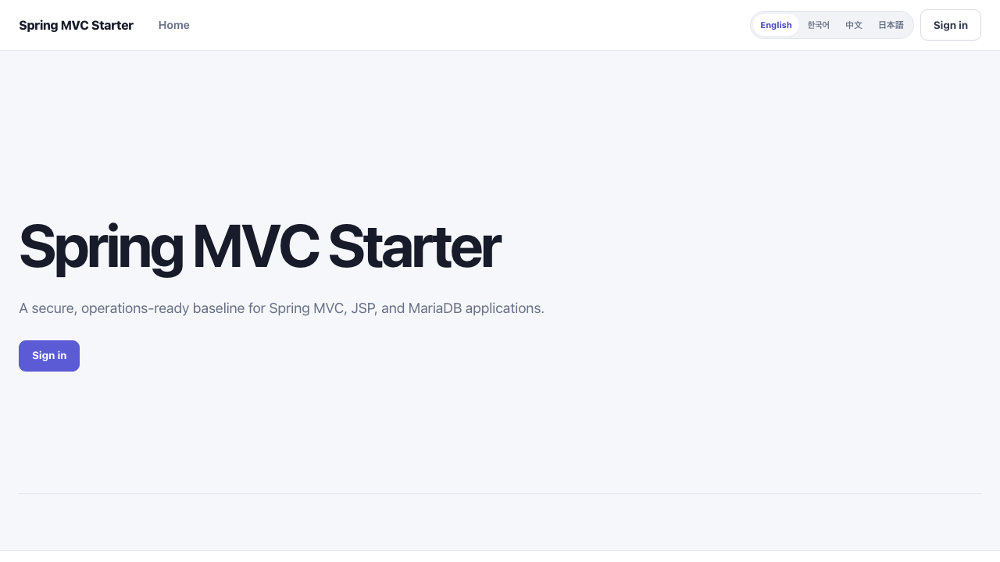
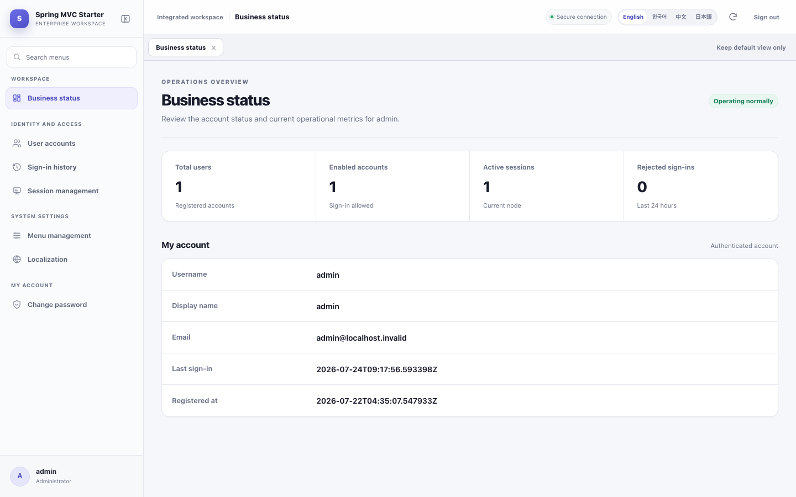
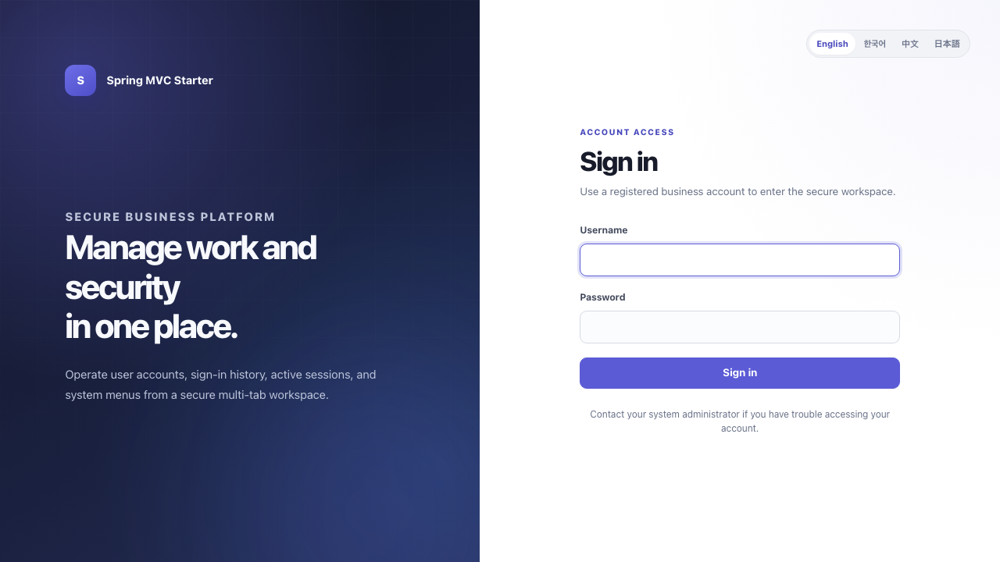
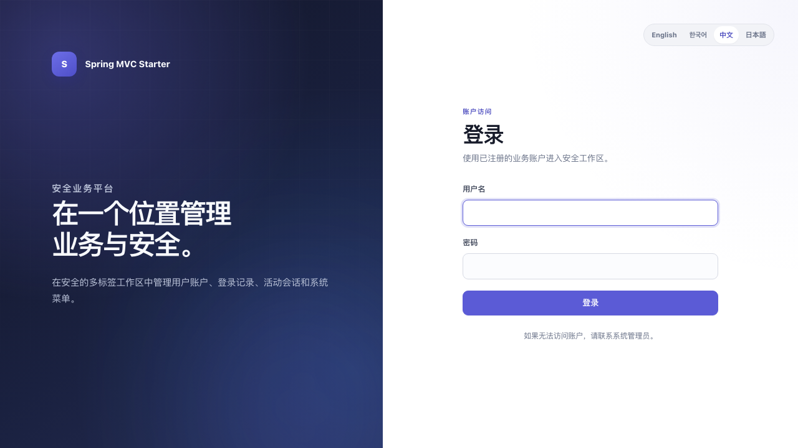
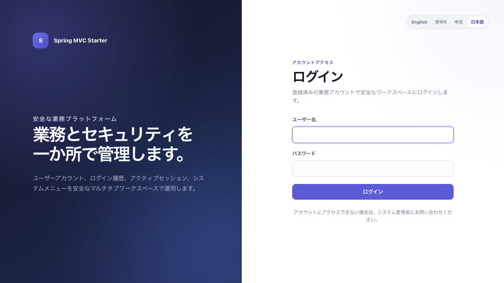
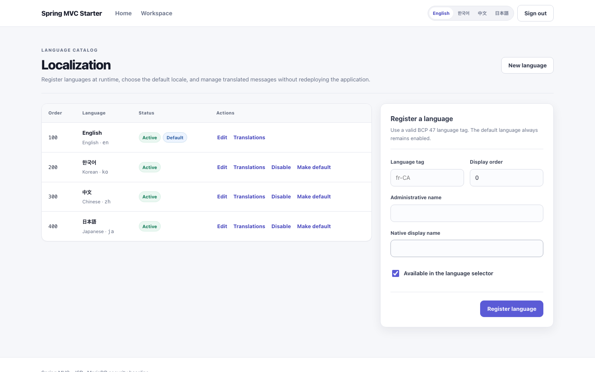
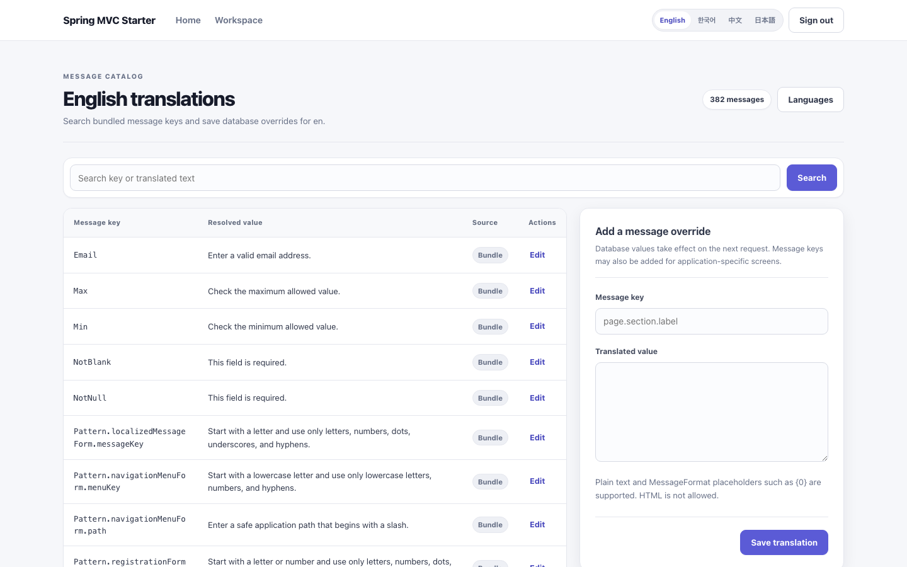

**English** | [한국어](README.ko.md) | [简体中文](README.zh.md) | [日本語](README.ja.md)

# Secure Spring MVC JSP Starter

Secure Spring MVC JSP Starter is a security-focused baseline for business applications built with Spring MVC, JSP, and MariaDB. It goes beyond a login example by combining account lockout, session revocation, administrator safeguards, security auditing, SQL observation, container hardening, database-managed localization, and a multi-tab workspace.

The current baseline uses Java 21, Spring Boot 4.1.0, and MariaDB 12.3.2 LTS. The application is packaged as an executable WAR because Spring Boot does not support JSP in an executable JAR.



This starter is designed for internal systems, back-office tools, and operations portals where authentication, authorization, auditing, and administration otherwise have to be rebuilt for every project. It provides application and session invariants, database migrations, operational logs, container execution, and verification standards together with the UI.

## At a glance

| Area | Included baseline |
| --- | --- |
| Server | Java 21, Spring Boot, Spring MVC, JSP/JSTL, executable WAR |
| Data | MariaDB, Spring Data JPA, Flyway, HikariCP |
| Security | Spring Security, Argon2, CSRF, CSP, session limits, account lockout, audit log |
| Administration | User accounts, sign-in history, active sessions, dynamic menus, localization, password change |
| Business UI | Full-screen shell, permission-aware navigation, multi-tab content, responsive layout |
| Localization | English default, complete English/Korean/Chinese/Japanese UI, runtime language and translation management |
| Operations | Docker Compose, health probes, separated structured logs, SQL and slow-query observation |
| Supply chain | Third-party license report, CycloneDX SBOM, automated dependency updates |

## Included application standards

### Full-screen business workspace

- Desktop-style, full-screen layout after sign-in
- Database-backed navigation ordered and filtered by group, role, and display order
- Same-origin iframe tabs that keep multiple JSP business screens open
- Per-user open and active tabs stored in `sessionStorage` and restored after refresh
- Menu search, collapsible sidebar, current-tab refresh, default-tab cleanup, and mobile navigation
- Toolbars, metric strips, data grids, and editing panels instead of generic card-only administration
- Semantic CSS tokens with a separate `theme-modern.css` layer for color, density, radius, and elevation
- Light neutral navigation and compact rounded workspace tabs
- Active tabs distinguished without accent strips or underline indicators, using surface, text, weight, and accessibility state
- Built-in user, sign-in history, session, menu, localization, and password administration screens

Business screen URLs come from database menu definitions. Only server-approved internal paths can open in tabs. Tab state remains within the browser session so users can move between list and edit screens without losing their workspace context.



### Database-managed localization

- English is the default; home, sign-in, registration, errors, workspace, and every administration screen are complete in English, Korean, Simplified Chinese, and Japanese
- Languages can be registered, edited, ordered, enabled, and selected as the default from the localization administration screen
- Any bundled message key can be searched and overridden in MariaDB; changes take effect on the next request without a redeploy
- First-visit language resolution uses active database locales and `Accept-Language`, then falls back to the database default
- Language selectors in the header, sign-in panel, and workspace
- Selected locale stored in an `HttpOnly`, `SameSite=Lax` cookie, with `Secure` enabled for production HTTPS
- Safe query parameters, such as sign-in history filters and pagination, preserved after a language change
- External URLs, protocol-relative URLs, and unsafe return paths rejected by redirect validation
- Plain-text validation, `MessageFormat` validation, bounded caching, and immediate cache invalidation after committed administration changes
- Default database menus translated through `navigation.menu.<menu-key>.label/group`
- Custom database menu text used as a safe fallback
- Environment variables provide an empty-catalog fallback and configure cookie security, browser-language behavior, and cache bounds

To add a language at runtime, register its BCP 47 tag and translations under **Localization**. A static `messages_<language-tag>.properties` bundle is optional but recommended when the new language should ship with a complete reviewed baseline. `MessageBundleConsistencyTest` verifies identical nonblank keys across the four built-in bundles, including generated enum message codes.

| English | 한국어 | 简体中文 | 日本語 |
| --- | --- | --- | --- |
|  |  |  |  |

| Language catalog | Translation editor |
| --- | --- |
|  |  |

### Administration screens

| Screen | Main capabilities | Required role |
| --- | --- | --- |
| Business status | Account, sign-in, session metrics, and recent security events | User |
| User accounts | Search accounts, change roles or state, and unlock accounts | Administrator |
| Sign-in history | Review success/failure, request ID, timestamp, and remote address | Administrator |
| Session management | Inspect active sessions and revoke selected sessions | Administrator |
| Menu management | Edit group, order, internal path, role, and visibility | Administrator |
| Localization | Register languages, choose the default, and edit database message overrides | Administrator |
| Change password | Verify the current password, enforce policy, then expire every session | User |

### Authentication and account invariants

- Normalized usernames and duplicate prevention
- Registration disabled by default and opened only through configuration
- `DelegatingPasswordEncoder` with an Argon2id-family default
- Detection of legacy bcrypt, PBKDF2, and scrypt hashes with automatic upgrade after sign-in
- Password policy for length, control characters, and username/email inclusion
- Current-password verification, same-password reuse prevention, and global session expiry after a change
- Username- and IP-based sign-in throttling with database-backed account lockout
- Non-enumerating authentication failure messages
- Credential length and complete form-size limits before expensive hash operations
- One-time bootstrap administrator creation
- Prevention of self-disable and self-removal of the administrator role
- Protection for the last administrator and last active administrator
- Session revocation after role or account-state changes

### Web security

- Spring Security CSRF protection and POST-only state changes
- Session ID rotation after sign-in, concurrent-session limits, and cookie/session cleanup at sign-out
- Configurable `HttpOnly`, `Secure`, and `SameSite` session cookies
- CSP, Permissions-Policy, Referrer-Policy, HSTS, same-origin framing, and MIME-sniffing protection
- No-store behavior for authentication pages and safe error screens
- Escaped JSP output and views protected under `/WEB-INF/views`
- Request IDs, newline removal to prevent log forging, and error responses that hide detailed exceptions

### Data and operations

- Versioned Flyway schema, Hibernate `validate`, and Open Session in View disabled
- Environment-configured HikariCP timeout, lifetime, and pool size
- Separate application, security audit, and SQL logs with size/time rotation
- SQL bind-value logging disabled by default
- MariaDB slow-query table enabled for local observation
- Security events recorded in both the database and dedicated audit log
- Dynamic menus introduced through Flyway V2 with audited administration changes
- Runtime language and message catalogs introduced through Flyway V3 with audited changes and bounded caches
- Public Actuator health/info endpoints and administrator-restricted management endpoints
- Graceful shutdown, liveness/readiness probes, non-root user, and read-only application container

## Quick start

Only Docker is required; a local Java or Maven installation is optional.

### Requirements

- Docker Engine or Docker Desktop with Compose v2
- `make`, or the equivalent Docker Compose commands from the `Makefile`
- Free local ports `8080` and `3306`, or custom values in `.env`

Create the local environment file from the repository root:

```sh
make init
```

The command generates random database and bootstrap-administrator passwords, writes `.env` with mode `600`, and never replaces an existing file. Review ports and bootstrap settings, then start the stack:

```sh
make up
```

After the containers become healthy:

1. Sign in at `http://127.0.0.1:8080/login` with `APP_BOOTSTRAP_ADMIN_USERNAME` and `APP_BOOTSTRAP_ADMIN_PASSWORD` from `.env`.
2. Verify that English, Korean, Chinese, and Japanese switch immediately and remain selected after refresh.
3. Change the temporary password. The change expires all existing sessions.
4. Set `APP_BOOTSTRAP_ADMIN_ENABLED=false` before the next start.
5. Run the smoke checks.

```sh
make smoke
```

If a default port is already in use, change only `APP_PORT` or `DB_PORT` in `.env`. Both services bind to `127.0.0.1` by default.

```sh
make logs         # Follow application and database logs
make test         # Run the complete automated test suite
make package      # Test and build the executable WAR
make public-check # Scan the repository for unsafe public content
make down         # Stop containers while preserving the database volume
```

With a local Java 21 installation, `./mvnw test` and `./mvnw clean package` are also supported. The WAR is written to `target/secure-mvc-starter.war`.

### Health endpoints

| URL | Expected result |
| --- | --- |
| `http://127.0.0.1:8080/login` | Sign-in screen |
| `http://127.0.0.1:8080/internal/actuator/health` | Application health |
| `http://127.0.0.1:8080/internal/actuator/health/liveness` | Process liveness |
| `http://127.0.0.1:8080/internal/actuator/health/readiness` | Request readiness |

Use `make logs` to inspect both application and database output. `make down` preserves the database volume, so decide explicitly before removing persistent data.

## Customize after cloning

1. Update `groupId`, `artifactId`, `name`, and `finalName` in `pom.xml`.
2. Rename `com.example.webstarter` to the organization’s reverse-domain package.
3. Replace product copy in `messages*.properties` and adjust semantic design tokens in `theme-modern.css`. Keep structural behavior in `app.css`.
4. Keep the existing `V1` through `V3` Flyway migrations immutable. Add business tables in a new migration version.
5. If authorization extends beyond `USER` and `ADMIN`, introduce capability-oriented roles and update service-level `@PreAuthorize` rules.
6. Complete the [security checklist](docs/SECURITY-CHECKLIST.md) and [operations guide](docs/OPERATIONS.md) before deployment.

Changing an applied Flyway file changes its checksum. Never rewrite an existing production migration; add the next version instead.

## Project structure

```text
src/main/java/com/example/webstarter
├── config       Environment configuration and Spring Security chains
├── security     Authentication, passwords, throttling, and session revocation
├── user         User domain and account services
├── admin        Administration features and invariants
├── audit        Database and file security events
├── bootstrap    One-time administrator creation
├── navigation   Database menus, safe paths, role filtering, and localization
├── localization Runtime locale catalog, message overrides, validation, and caching
└── web          MVC, locale handling, request IDs, headers, and access logs
```

See [ARCHITECTURE.md](docs/ARCHITECTURE.md) for request flows and extension boundaries.

## Configuration principles

Runtime values are not embedded in application code. Every operational setting in `application.yml` can be overridden through environment variables.

| Area | Representative variables | Baseline |
| --- | --- | --- |
| Database | `DB_URL`, `DB_USERNAME`, `DB_PASSWORD`, `DB_POOL_MAX_SIZE` | External secrets and a bounded pool |
| Session | `SESSION_COOKIE_SECURE`, `SESSION_COOKIE_SAME_SITE`, `SESSION_TIMEOUT`, `APP_SESSION_METADATA_MAX_ENTRIES` | Production HTTPS, 30 minutes, Lax, bounded metadata |
| Localization | `APP_I18N_DEFAULT_LOCALE`, `APP_I18N_SUPPORTED_LOCALES`, `APP_I18N_COOKIE_*`, `APP_I18N_CACHE_*` | Database catalog with an English fallback, secure cookie, and bounded caches |
| Password hashing | `APP_PASSWORD_ALGORITHM`, `APP_ARGON2_*` | Argon2 with startup validation |
| Sign-in protection | `APP_LOGIN_*`, `APP_ACCOUNT_LOCK_*` | IP/identifier limits and account lockout |
| Headers | `APP_CONTENT_SECURITY_POLICY`, `APP_FRAME_OPTIONS`, `APP_PERMISSIONS_POLICY`, `APP_HSTS_*` | External framing blocked and same-origin workspace tabs allowed |
| Logging | `APP_SQL_LOG_LEVEL`, `APP_SQL_BIND_LOG_LEVEL`, `APP_LOG_*` | Production SQL off and bind values off |
| Management | `MANAGEMENT_ENDPOINTS`, `APP_ADMIN_PAGE_SIZE` | Minimal endpoints and bounded pages |
| HTTP input | `SERVER_MAX_FORM_POST_SIZE`, `SERVER_MAX_PARAMETER_COUNT` | Early rejection of oversized forms and parameters |
| Workspace | `APP_WORKSPACE_MAX_TABS`, `APP_WORKSPACE_DEFAULT_MENU_KEY`, `APP_WORKSPACE_RESERVED_PATHS` | Tab limit, start view, and sensitive-path protection |

The [operations guide](docs/OPERATIONS.md) contains the complete list and deployment examples.

## Query observation

The local profile writes Hibernate SQL to `/app/logs/sql.log`. Bind values can contain passwords, tokens, or personal data, so `APP_SQL_BIND_LOG_LEVEL=OFF` is the default and recommended production setting.

```sh
docker compose --env-file .env exec app sh -c 'tail -f /app/logs/sql.log'
docker compose --env-file .env exec db mariadb -uroot -p
```

Inspect slow statements from the database console:

```sql
SELECT start_time, query_time, rows_examined, sql_text
FROM mysql.slow_log
ORDER BY start_time DESC
LIMIT 50;
```

Set a retention policy for the slow log in production. High-traffic systems should use file output or a central observability platform.

## Deliberate boundaries

This repository is a secure starting point, not a complete identity product. Email ownership verification, password-reset email, MFA/passkeys, SSO/OIDC, CAPTCHA, and personal-data retention policy require business-specific infrastructure and are intentionally not simulated.

For internet-facing registration, add at least email verification and account recovery. In a multi-instance deployment, replace in-memory sign-in throttling and `SessionRegistry` with a shared rate limiter and Spring Session. Use separate database accounts for migration and runtime access.

## License and supply chain

The project source is available under the [Apache License 2.0](LICENSE). Third-party licenses and redistribution notes are documented in [THIRD-PARTY-NOTICES.md](THIRD-PARTY-NOTICES.md).

`clean package` generates `target/generated-sources/license/THIRD-PARTY.txt` for direct and transitive dependencies. Missing license metadata fails the build. A CycloneDX SBOM is packaged under `META-INF/sbom`.

```sh
make license-report
make package
```

## Public repository safeguards

[AGENTS.md](AGENTS.md) defines provider-neutral language, removal of workstation data and secrets, screenshot inspection, and dependency-license review as repository rules. Enable the included hooks after cloning:

```sh
git config core.hooksPath .githooks
./scripts/public-release-check.sh repository
```

The scanner rejects environment files, keys, certificates, logs, build output, oversized files, absolute user paths, and high-confidence secret patterns. Personal deny patterns can be stored one per line in `.git/info/public-release-deny-patterns` without committing them.

See [CONTRIBUTING.md](CONTRIBUTING.md) for the contribution process.

## Reference standards

- [Spring Boot Servlet/JSP documentation](https://docs.spring.io/spring-boot/4.0/reference/web/servlet.html)
- [Spring Boot traditional WAR deployment](https://docs.spring.io/spring-boot/how-to/deployment/traditional-deployment.html)
- [Spring Security CSRF](https://docs.spring.io/spring-security/reference/7.0/servlet/exploits/csrf.html)
- [Spring Security security headers](https://docs.spring.io/spring-security/reference/features/exploits/headers.html)
- [OWASP Password Storage Cheat Sheet](https://cheatsheetseries.owasp.org/cheatsheets/Password_Storage_Cheat_Sheet.html)
- [OWASP Authentication Cheat Sheet](https://cheatsheetseries.owasp.org/cheatsheets/Authentication_Cheat_Sheet.html)
- [MariaDB Connector/J](https://mariadb.com/docs/connectors/mariadb-connector-j/about-mariadb-connector-j)
