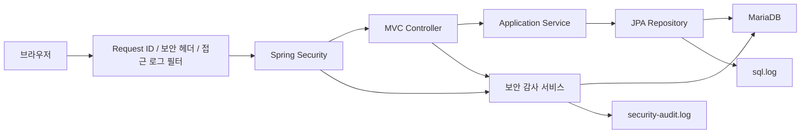
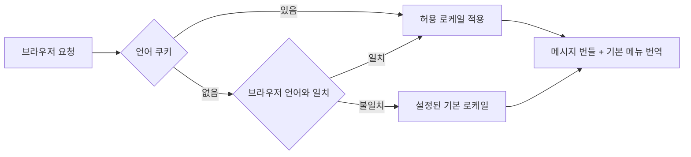
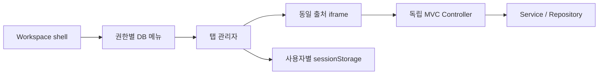
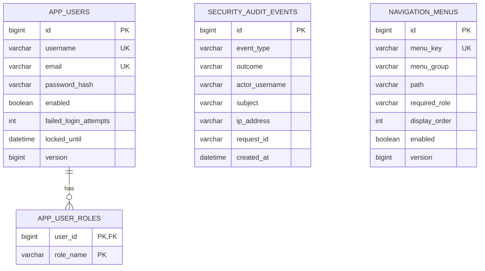

# 아키텍처 기준

## 설계 목표

이 시작점은 화면을 빠르게 띄우는 것보다 새 서비스에서 반복되는 보안·운영 결정을 빠뜨리지 않는 데 초점을 둡니다. 환경별 숫자와 비밀값은 설정으로 옮기고, 업무 코드가 보안 프레임워크에 직접 얽히지 않도록 계정·보안·감사 책임을 분리했습니다.

핵심 원칙은 다음과 같습니다.

- 요청 검증, 권한 검사, 도메인 불변 조건을 서로 다른 층에서 중복 확인합니다.
- 인증 성공 여부와 무관하게 중요한 보안 행위는 감사 가능한 이벤트로 남깁니다.
- DB 스키마 변경은 애플리케이션 코드와 함께 버전 관리하고 시작 시 검증합니다.
- 운영 안전성이 확인되지 않은 기능은 기본적으로 닫습니다.
- 단일 노드용 구현과 분산 환경에서 교체해야 할 지점을 문서로 명확히 구분합니다.
- 업무 화면은 독립된 MVC 흐름을 유지하면서 전체 화면 셸에서 동시에 사용할 수 있어야 합니다.

## 요청 흐름

`RequestIdFilter`가 가장 먼저 요청 ID를 받아들이거나 생성합니다. 외부 `X-Request-ID`는 허용된 문자와 길이를 검증한 뒤에만 사용합니다. `BaselineSecurityHeadersFilter`는 JSP 내부 포워드 이후에도 헤더가 사라지지 않도록 응답 초기에 기준 헤더를 기록하고, Spring Security 헤더 설정이 한 번 더 같은 정책을 적용합니다. `RequestLoggingFilter`는 처리 시간, 상태 코드, 원격 주소를 기록하되 요청 본문과 쿼리 문자열은 수집하지 않습니다.

## 다국어 요청 흐름

`CookieLocaleResolver`는 설정된 언어 쿠키를 가장 먼저 확인합니다. 쿠키가 없는 첫 요청에는 `APP_I18N_SUPPORTED_LOCALES` 안에서 브라우저 `Accept-Language`와 가장 가까운 언어를 선택하고, 일치하지 않으면 `APP_I18N_DEFAULT_LOCALE`을 사용합니다. 임의 로케일이 파일명이나 메시지 조회 경로로 전달되지 않도록 `/locale`은 허용 목록의 정확한 BCP 47 태그만 받아들이며, 클라이언트가 쿠키 값을 직접 바꾸더라도 허용 목록에 매핑되지 않으면 같은 기본 선택 흐름으로 되돌립니다.

언어 선택 링크는 현재 애플리케이션 경로와 쿼리를 반환 주소로 전달합니다. `LocaleController`가 스킴·호스트·프래그먼트·경로 이동·역슬래시·개행을 거부한 뒤에만 리다이렉트하므로 열린 리다이렉트로 사용할 수 없습니다. 기본 메뉴는 메뉴 키를 메시지 키로 변환해 번역하고, 메시지가 없는 사용자 정의 메뉴는 DB에 저장된 이름과 그룹을 그대로 사용합니다. 탭 복원 데이터에는 메뉴 키만 남기므로 언어를 바꾼 뒤 셸을 다시 읽으면 열린 탭도 새 메뉴 이름으로 재구성됩니다.

## 전체 화면 업무 셸과 탭 경계

`/workspace`는 인증된 사용자의 권한으로 `navigation_menus`를 조회해 전체 화면 탐색 영역을 만듭니다. 메뉴를 선택하면 각 업무 URL을 동일 출처 iframe에 열고, 탭마다 iframe을 제거하지 않고 숨겨 입력값과 스크롤 위치를 유지합니다. 저장소에는 서버가 렌더링한 메뉴 키만 기록하며 URL은 복원할 때마다 현재 DOM의 검증된 메뉴에서 다시 가져옵니다.

같은 애플리케이션의 JSP를 iframe으로 구성하기 위해 기본 헤더는 `X-Frame-Options: SAMEORIGIN`, CSP는 `frame-ancestors 'self'`입니다. 따라서 다른 출처의 페이지는 여전히 이 화면을 프레임으로 감쌀 수 없습니다. 메뉴 경로는 스킴·호스트·쿼리·프래그먼트·상위 경로 이동을 거부하고, `/workspace`, 인증 URL, 정적 자산과 내부 관리 경로도 설정된 예약 목록으로 차단해 재귀 프레임과 민감 경로 오용을 막습니다.

## 인증과 세션

`DaoAuthenticationProvider`는 `AppUserDetailsService`와 `DelegatingPasswordEncoder`를 사용합니다. 저장된 해시에 알고리즘 식별자가 있으므로 기존 bcrypt·PBKDF2·scrypt 계정을 읽을 수 있고, 현재 기본 알고리즘과 강도가 다르면 로그인 성공 과정에서 새 해시로 갱신합니다.

실패 처리는 두 단계입니다.

1. Caffeine 제한기가 IP와 정규화된 사용자명의 실패 횟수를 짧은 시간 동안 제한합니다. 키는 SHA-256으로 변환해 메모리 덤프에서 원문 식별자가 바로 노출되지 않게 합니다.
2. 실제 존재하고 활성화된 계정은 MariaDB 행 잠금 안에서 실패 횟수를 증가시키고 임계값에 도달하면 `locked_until`을 설정합니다.

두 단계보다 앞에서 사용자명과 비밀번호 길이를 검사합니다. 설정 상한을 넘긴 자격 증명은 해시와 사용자 조회를 수행하지 않고 IP 실패와 `LOGIN_INPUT_REJECTED` 감사 이벤트만 남깁니다. Tomcat 폼 본문 상한도 별도로 두어 필터에 도달하기 전 과도한 요청을 413으로 거부합니다.

외부 응답은 존재하지 않는 사용자, 잘못된 비밀번호, 잠긴 계정을 같은 로그인 실패로 표현합니다. 관리자는 잠금을 풀 수 있지만 마지막 관리자 보호 규칙은 서비스 트랜잭션과 비관적 잠금 안에서 판정합니다.

세션은 로그인할 때 ID를 바꾸고 동시 접속 수를 제한합니다. 로그인 시각·IP·User-Agent·최근 경로는 상한이 있는 `SessionMetadataStore`에 두고 세션 파기 이벤트와 함께 제거합니다. 관리자 화면에는 원 세션 ID 대신 SHA-256 지문을 표시하며, 종료 폼도 원 ID가 아닌 64자리 다이제스트 토큰을 사용합니다. 서버가 활성 세션을 다시 대조한 뒤에만 만료하므로 HTML과 감사 로그에 원 세션 ID가 남지 않습니다.

비밀번호 변경, 계정 비활성화, 역할 변경 시 `SessionRegistry`에 등록된 해당 사용자의 세션을 만료시킵니다. 이 목록과 메타데이터는 단일 노드 기준이므로 다중 노드에서는 공유 세션 저장소가 필요합니다.

## 권한 모델

기본 역할은 `USER`, `ADMIN` 두 개입니다. `ADMIN` 사용자도 `USER` 역할을 함께 가집니다.

- URL 규칙은 `/admin/**`와 Actuator의 비공개 엔드포인트를 보호합니다.
- 관리자 서비스에는 클래스 수준 `@PreAuthorize("hasRole('ADMIN')")`가 있어 다른 진입 경로도 막습니다.
- 자기 비활성화와 자기 권한 제거를 금지합니다.
- 관리자 행을 순서대로 잠근 뒤 마지막 관리자/마지막 활성 관리자 여부를 검사해 동시 변경 경쟁을 줄입니다.

업무 권한이 늘어나면 역할을 무작정 추가하기보다 `ORDER_READ`, `ORDER_REFUND` 같은 기능 권한을 도입하고 역할-권한 매핑을 별도 테이블로 분리하는 편이 확장에 유리합니다.

## 데이터 모델

모든 시간은 애플리케이션에서 `Instant`로 다루고 Hibernate JDBC 시간대를 UTC로 고정합니다. 화면 표시 시간대는 서비스 정책에 맞는 변환 계층을 추가해야 합니다. 엔티티에는 낙관적 잠금용 `version`이 있고, 로그인 실패·관리자 변경처럼 경쟁이 중요한 작업은 명시적인 비관적 잠금을 함께 사용합니다.

## 로그와 감사의 구분

- `application.log`: 시작, 종료, HTTP 접근, 애플리케이션 오류
- `security-audit.log`: 로그인, 로그아웃, 접근 거부, 비밀번호/역할/상태 변경
- `sql.log`: Hibernate가 실행한 SQL 문장. 바인드 값은 별도 설정이며 기본 OFF
- `security_audit_events`: 관리 화면이나 조사 도구에서 검색할 수 있는 구조화된 감사 원본
- `mysql.slow_log`: DB가 실제 실행 시간 기준으로 수집한 느린 쿼리

감사 기록 실패가 사용자의 비밀번호 변경이나 로그아웃을 되돌리지 않도록 현재 구현은 감사 저장을 fail-open으로 처리하고 애플리케이션 오류를 남깁니다. 금융·규제 환경에서 감사 누락이 허용되지 않는다면 트랜잭셔널 아웃박스와 별도 수집기를 사용해 전달 보장을 강화해야 합니다.

## 배포 단위

JSP 제약 때문에 `secure-mvc-starter.war`를 생성합니다. 같은 WAR를 `java -jar`로 실행하거나 외부 Servlet 6.1 호환 컨테이너에 배포할 수 있습니다. Docker 이미지는 빌드와 런타임을 분리하고 비루트 사용자, 읽기 전용 루트 파일시스템, `/tmp` tmpfs, 로그 볼륨만 허용합니다.

운영에서는 TLS 종료 프록시 뒤에 두고 프록시가 정제한 전달 헤더만 신뢰해야 합니다. 컨테이너 포트를 인터넷에 직접 공개하지 않는 구성이 기준입니다.

## 교체가 예정된 확장 지점

| 상황 | 현재 구현 | 교체 기준 |
|---|---|---|
| 다중 앱 인스턴스 | Caffeine 제한기 | Redis 원자 카운터/전용 rate limiter |
| 다중 앱 인스턴스 | 로컬 `SessionRegistry` | Spring Session + Redis/JDBC |
| 중앙 감사 | DB + 파일 | 아웃박스 + SIEM/로그 파이프라인 |
| 공개 회원가입 | 즉시 활성 계정 | 이메일 검증, 봇 방지, 약관 이력 |
| 계정 복구 | 미포함 | 만료·1회용 토큰과 별도 알림 채널 |
| 높은 보안 등급 | 비밀번호 | WebAuthn/passkey 또는 MFA, OIDC |
| 무중단 DB 배포 | 앱 기동 시 Flyway | 별도 마이그레이션 잡과 권한 분리 |
